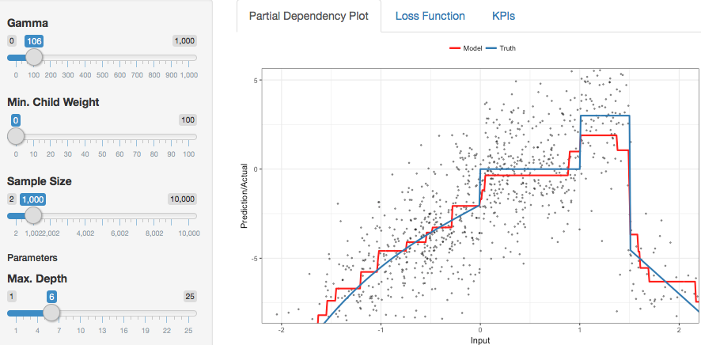
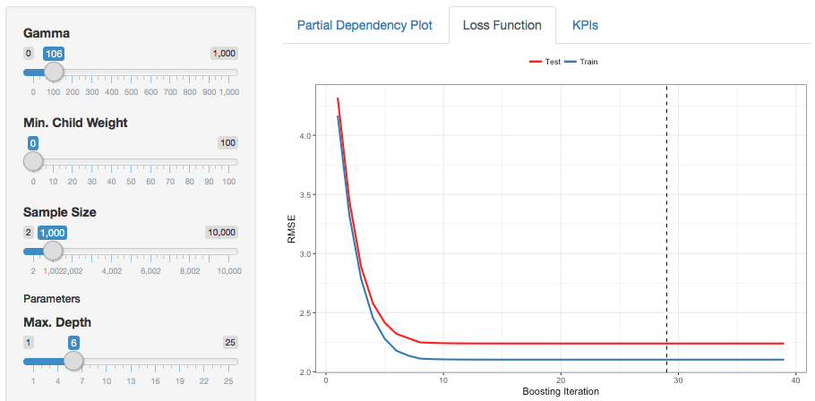

# xgbviz
This interactive application illustrates the mechanics of the most important parameters in tree-based gradient boosting. You can [try out the app online](https://maximilianeber.shinyapps.io/xgbviz/). For better performance, install the app locally via:

```r
devtools::install_github('maximilianeber/xgbviz')
```
To run the app on your computer, open `server.R` in RStudio and click on `Run App`.

## Input parameters

You can modify the most important parameters in [XGBOOST](https://github.com/dmlc/xgboost) models

* Gamma
* Minimum child weight
* Sample size
* Maximum depth
* Maximum number of boosting iterations
* Early stopping
* Learning rate

## Partial dependency plot

The partial dependency plot shows how well the learned function approximates the underlying data generating process. This is particularly interesting as you change the parameters *Gamma*, *Minimum child weight*, as well as the *Sample size* of the training data.



## Loss function

This tab plots the performance (RMSE) on the training set as well as the test set against the number of boosting iterations. This is particularly interesting as you change the *Learning rate*, *Max. number of boosting iterations*, and *Early stopping*.



Check out the online version: https://maximilianeber.shinyapps.io/xgbviz.
